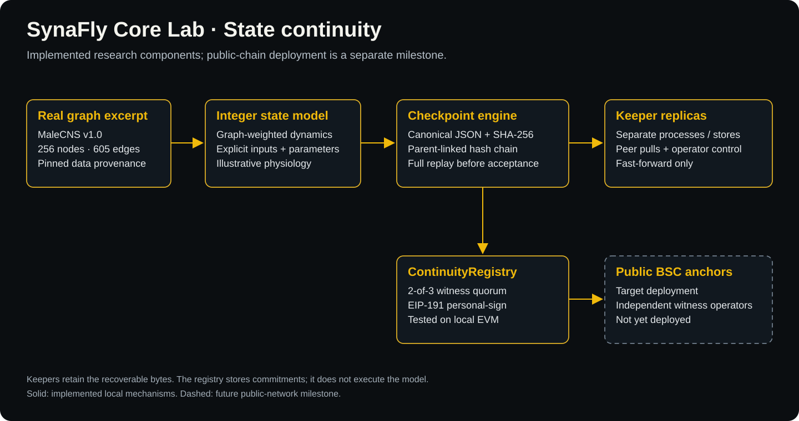
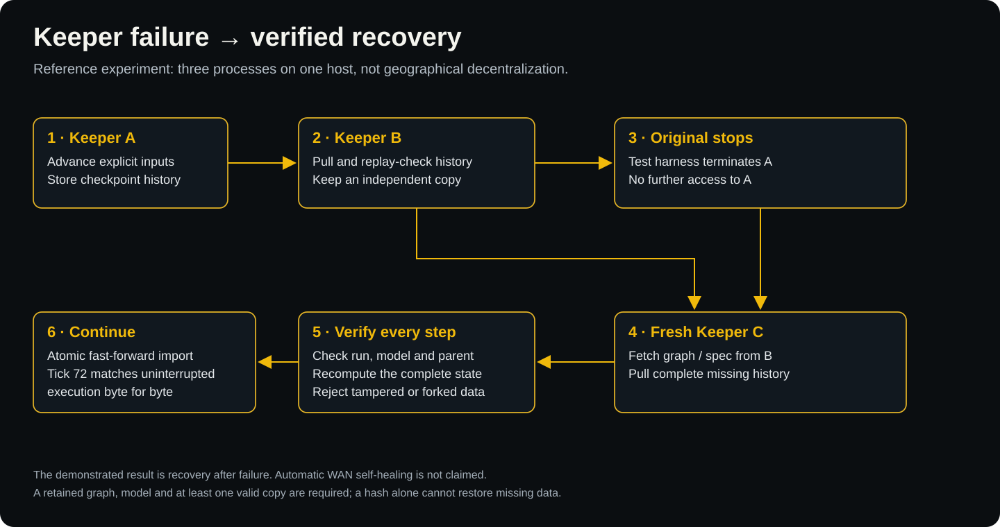
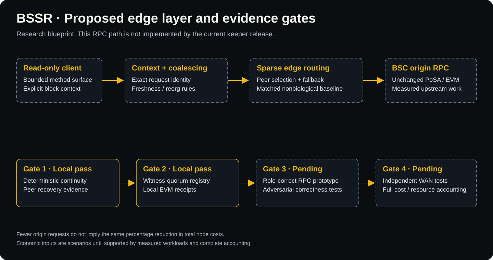

# SynaFly Core Lab

**Verifiable digital continuity. Toward bio-sparse edge infrastructure for BNB Chain.**

**Research release v0.1** · **Python core: MIT** · **MaleCNS sample: CC BY 4.0** · **EVM registry: local tests passed**

SynaFly explores two connected questions: can a digital model's state outlive its
original host, and can connectome-inspired sparse execution inform useful edge
infrastructure? This first progressive release provides an executable foundation:
real connection weights, deterministic state evolution, replay-verified checkpoint
history, peer recovery and a BSC-compatible witness-quorum registry.

The ambition is broader than this release. **BSSR (Bio-Sparse Synaptic Relay)** is
our proposed outer edge layer for role-specific BSC offloading. Its RPC caching,
routing and cost-reduction hypotheses are specified in the
[feasibility blueprint](docs/bsc-feasibility.md); they are not presented as an
implemented RPC relay or a measured ecosystem saving.

- **Website / separate browser experience:** [synafly.fyi](https://synafly.fyi/)
- **Project-designated BSC token:** [`0x259dd071f40d96e61f2bcc663bfac6898d957777`](https://bscscan.com/token/0x259dd071f40d96e61f2bcc663bfac6898d957777)
- **Scope:** a partial release of research components, not a claim that the whole live product is open source.

The token address is **not** a deployment address for `ContinuityRegistry`.
Public research-registry deployments remain explicitly marked
[not deployed](deployments/bsc-testnet.json).

## The vision: continuity beyond one host

The "immortal fruit fly" idea motivates a concrete engineering problem: preserve
model definitions, state and interaction history so another host can verify and
resume them. We use *continuity* in that operational sense—not as a claim of
consciousness, biological immortality or guaranteed permanent availability.

Two complementary tracks matter:

1. **Recoverable state and inspectable commitments.** Keepers retain the bytes;
   a registry records quorum-authenticated checkpoint commitments and their order.
2. **Computation made visible.** The separate browser experience turns verified
   local-compute results into illustrative neural light. Visual feedback is not
   evidence that a biological action potential occurred.

A chain commitment can make retained history tamper-evident. It cannot reconstruct
missing data after all copies disappear. No endorsement by CZ, BNB Chain or any
referenced research institution is implied. [Research context](docs/research-context.md).

## Architecture of this release



The solid components below are implemented. Future public-chain/WAN milestones
are visually separated in the diagrams and in the [claim ledger](docs/claims.md).

| Component | Implemented scope | Evidence |
|---|---|---|
| Connectome input | 256 annotated MaleCNS nodes and 605 observed directed weighted edges; pinned excerpt and annotation hashes | [Provenance](data/provenance.json) |
| Dynamics | Integer LIF-inspired toy model; real graph weights affect state; signs/parameters are illustrative | [Model](synafly_lab/model.py), [ablation](results/ablation.json) |
| Checkpoints | Content-addressed **hash chain**, full state/input serialization, deterministic replay and atomic fast-forward import | [Checkpoint](synafly_lab/checkpoint.py), [store](synafly_lab/store.py) |
| Keepers | Independent processes/stores, authenticated administration, configured peer pulls, stale/fork rejection | [Node](synafly_lab/node.py), [peer](synafly_lab/peer.py) |
| Recovery | Original process is terminated; a fresh process restores graph/history from a survivor and continues identically | [Recovery result](results/continuity.json) |
| EVM registry | Immutable 2-of-3 witness quorum, parent/sequence/model guards and **EIP-191 personal-sign** verification with chain/contract binding | [`ContinuityRegistry.sol`](contracts/ContinuityRegistry.sol) |
| Anchor adapter | Read-only preparation and exact receipt/event checks; local Anvil demo uses synthetic accounts | [Adapter](synafly_lab/anchor.py), [local EVM result](results/local-evm.json) |

**Scale is explicit:** the live viewer displays 141,781 measured soma positions.
This repository's current dynamical model uses the smaller 256-node connection
sample. Its v1 engine limit is 2,048 nodes; it is not a full-brain emulation.
The sample is biased toward strong connections and is not a complete induced
subgraph. [Data coverage and attribution](data/NOTICE.md).

The live browser build currently uses a single SHA-256d Worker and an HTTP
challenge-verification API. The lab release does **not** include Stratum,
WebSocket mining, WebGL source or a high-concurrency/60-FPS guarantee.

## Recovery flow



This demonstrates **recovery after failure**, orchestrated by the reproducible test
harness. It is not yet an unattended failure detector or autonomous WAN repair
system. All demonstrated nodes share one host/operator; independent operation is
a subsequent milestone.

## Reproduce the evidence

Python 3.12+; no third-party dependencies are required by the Python core.
From the repository root:

```sh
python3 -m unittest discover -s tests -v
python3 scripts/demo_continuity.py
python3 scripts/verify_history.py results/checkpoints.json
python3 scripts/benchmark.py
```

With an existing [Foundry installation](https://getfoundry.sh/):

```sh
forge test -v
python3 scripts/demo_evm.py
```

The Solidity compiler is pinned to 0.8.30 and EVM target Paris. The local demo
starts its own Anvil, uses unlocked synthetic test accounts without exposing keys,
and stops only the processes it created. A local chain ID of 97 is **not** a BSC
testnet transaction. No public-chain signer or real-wallet key management exists.

Included evidence: [verification summary](results/verification.json),
[checkpoint replay](results/checkpoints.json), [cross-runtime consistency](results/cross-python.json),
[quorum rejection and counterfactual](results/quorum-verification.json).
This release reports state outcomes, not hardware timing benchmarks or proof of
biological superiority. Changing spike patterns does not prove better RPC routing.

## BSSR: a testable engineering program



BSSR studies an **outer edge layer**, leaving PoSA and EVM rules unchanged.
Potential roles include exact-context request coalescing, bounded read caching,
verified data distribution and fault-aware routing. Correctness, reorg behavior,
trust and added infrastructure cost are explicit constraints—not assumed away.

The [cost model](docs/bsc-feasibility.md#cost-scenarios-not-measured-savings) separates
avoidable RPC cost from total node cost and subtracts new relay/verification cost.
Node counts, traffic redundancy and dollar figures without supporting datasets are
**scenario inputs**, not telemetry or scientific findings. No $20M saving has been
measured by this release.

## Progressive source release

| Module | Release state |
|---|---|
| 1. Graph-driven state and checkpoint hash chain | Included in v0.1 |
| 2. Keeper replication and recovery harness | Included; local multi-process evidence |
| 3. EVM witness-quorum registry and receipt adapter | Included; local EVM evidence |
| 4. Browser compute client and validation API | Separate codebase; source release pending |
| 5. Measured-soma WebGL visualization | Separate codebase; source release pending |
| 6. BSSR RPC edge client and WAN experiments | Proposed; implementation/benchmarks pending |

Optional wire-protocol research, including legacy Stratum experiments, must have
its own reviewed release and must not be confused with the current HTTP demo.

## Project policy and technical enforcement

The project's declared allocation policy is to direct **100% of token creator-tax
proceeds received by the project** toward decentralized relay infrastructure.
This does not mean all BSC transaction fees or all Flap platform fees. This
research repository does not collect taxes, route funds or enforce the allocation.
Recipient disclosures and public expenditure records are needed to verify policy
execution; no return, buyback or price outcome is promised by this code.

## Documentation

- [BSSR feasibility and cost scenarios](docs/bsc-feasibility.md)
- [Protocol and model semantics](docs/protocol.md)
- [Architecture decisions](docs/architecture.md)
- [Claim-to-evidence ledger](docs/claims.md)
- [Security and trust boundaries](SECURITY.md)
- [Reproduce the data sample](docs/data-reproduction.md)
- [Release checklist](RELEASING.md)

Code: [MIT](LICENSE). Derived data: [CC BY 4.0 with attribution](data/NOTICE.md).
This is research software, not an audited production consensus or financial protocol.
