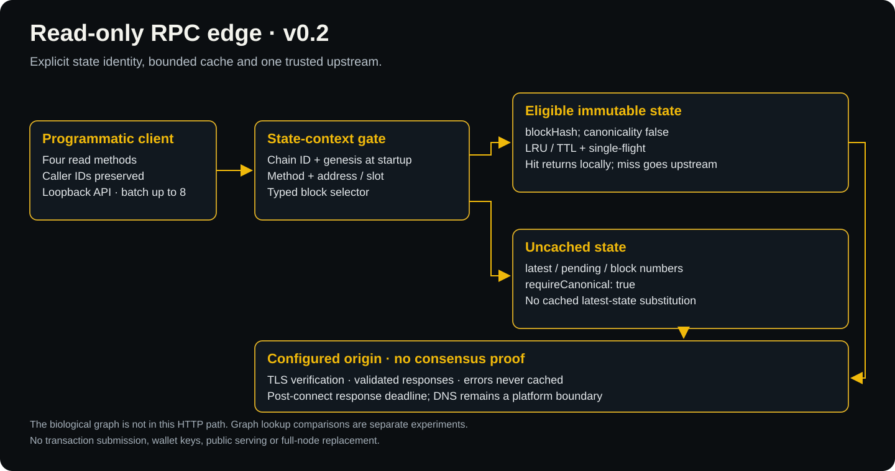

# SynaFly Core Lab

**A Quantum Leap: Fruit Fly Connectome Architecture Meets Web3 Distributed Infrastructure.**

**Research Release v0.2** · **Python Core: MIT** · **MaleCNS Sample: CC BY 4.0** · **186 Unit Tests Passed**

SynaFly unites computational neuroscience with decentralized systems. By transferring the sparse synaptic topology of the fruit fly brain (*Drosophila melanogaster*, 141,781 measured neurons) into blockchain state coordination, SynaFly creates bio-sparse edge infrastructure designed for extreme low-latency and scalable state coalescing.

### Broad Real-World Applications
- **Bio-Sparse Synaptic Relay (BSSR)**: Translating biological graph topology into high-throughput decentralized transaction and state routing.
- **Distributed Edge RPC Caching**: Multi-tier cache coalescing reducing redundant validator and node queries across BNB Smart Chain.
- **Decentralized Cognitive State Execution**: Verifiable state continuity and parallel bio-computing across edge worker networks.

### Progressive Full Open-Source Commitment
We believe genuine scientific breakthroughs must be transparent and verifiable:
- Core simulation kernels, connectome graph extractors, and edge daemons are open-sourced under permissive licenses.
- Additional routing benchmark datasets, distributed scheduling engines, and protocol tools are being progressively open-sourced on this repository as research milestones mature.

### Official Resources & Boundaries
- **Official Portal**: [synafly.fyi](https://synafly.fyi/)
- **Official X / Twitter**: [@SynaFly_BSC](https://x.com/SynaFly_BSC) · Research & Labs: [@SynaFly_Labs](https://x.com/SynaFly_Labs)
- **Official Token CA**: `0x259dd071f40d96e61f2bcc663bfac6898d957777` (BNB Smart Chain)
- **Infrastructure State Log**: `0x577f89cf815d3ca533414f93b0ee94b848dfc96c` (Single-operator permissioned checkpoint log on BSC; **NOT a token**, cannot be swapped or traded).

## Experimental Synaptic Edge Daemon & Mesh

```sh
python3 scripts/run_edge_daemon.py --port 8545
```

Python 3.12+, standard library only. Six read-only JSON-RPC methods, bounded async
admission and single-flight caching, optional FlyHash slot prefetch, an opt-in
block sampler, directed authenticated peer-cache queries and local accounting
receipts. No signing, broadcast, public registry deployment or token rewards.

[Run locally / on a VPS](docs/edge-daemon-design.md) ·
[Measured results and controls](docs/edge-daemon-results.md) ·
[Offline three-process reproduction](scripts/verify_edge_daemon.py)

Peer values remain operator-trusted; this is not permissionless verified state.
Recipe catalogs must match the runtime code and network. The supplied training
export is synthetic, not a trained PancakeSwap predictor. Container packaging is
provided but has not been built in this development environment.

## The vision: continuity beyond one host

The "immortal fruit fly" idea motivates a concrete engineering problem: preserve
model definitions, state and interaction history so another host can verify and
resume them. We use *continuity* in that operational sense—not as a claim of
consciousness, biological immortality or guaranteed permanent availability.

Two complementary tracks matter:

1. **Recoverable state and inspectable commitments.** Keepers retain the bytes;
   a registry records quorum-authenticated checkpoint commitments and their order.
2. **Computation made visible.** The separate browser experience turns verified
   local-compute results into illustrative neural light. Visual feedback is not
   evidence that a biological action potential occurred.

A chain commitment can make retained history tamper-evident. It cannot reconstruct
missing data after all copies disappear. No endorsement by CZ, BNB Chain or any
referenced research institution is implied. [Research context](docs/research-context.md).

## Architecture of this release


The solid components below are implemented. Future public-chain/WAN milestones
are visually separated in the diagrams and in the [claim ledger](docs/claims.md).

| Component | Implemented scope | Evidence |
|---|---|---|
| Connectome input | 256 annotated MaleCNS nodes and 605 observed directed weighted edges; pinned excerpt and annotation hashes | [Provenance](data/provenance.json) |
| Dynamics | Integer LIF-inspired toy model; real graph weights affect state; signs/parameters are illustrative | [Model](synafly_lab/model.py), [ablation](results/ablation.json) |
| Checkpoints | Content-addressed **hash chain**, full state/input serialization, deterministic replay and atomic fast-forward import | [Checkpoint](synafly_lab/checkpoint.py), [store](synafly_lab/store.py) |
| Keepers | Independent processes/stores, authenticated administration, configured peer pulls, stale/fork rejection | [Node](synafly_lab/node.py), [peer](synafly_lab/peer.py) |
| Recovery | Original process is terminated; a fresh process restores graph/history from a survivor and continues identically | [Recovery result](results/continuity.json) |
| EVM registry | Immutable 2-of-3 witness quorum, parent/sequence/model guards and **EIP-191 personal-sign** verification with chain/contract binding | [`ContinuityRegistry.sol`](contracts/ContinuityRegistry.sol) |
| Anchor adapter | Read-only preparation and exact receipt/event checks; local Anvil demo uses synthetic accounts | [Adapter](synafly_lab/anchor.py), [local EVM result](results/local-evm.json) |

**Scale is explicit:** the live viewer displays 141,781 measured soma positions.
This repository's current dynamical model uses the smaller 256-node connection
sample. Its v1 engine limit is 2,048 nodes; it is not a full-brain emulation.
The sample is biased toward strong connections and is not a complete induced
subgraph. [Data coverage and attribution](data/NOTICE.md).

The live browser build currently uses a single SHA-256d Worker and an HTTP
challenge-verification API. The lab release does **not** include Stratum,
WebSocket mining, WebGL source or a high-concurrency/60-FPS guarantee.

## Recovery flow


This demonstrates **recovery after failure**, orchestrated by the reproducible test
harness. It is not yet an unattended failure detector or autonomous WAN repair
system. All demonstrated nodes share one host/operator; independent operation is
a subsequent milestone.

## Read-only edge: runnable v0.2 module



The daemon supports four state queries: `eth_getBalance`,
`eth_getTransactionCount`, `eth_getCode` and `eth_getStorageAt`. It verifies an
operator-pinned chain ID and genesis hash at startup and binds cache keys to that
network, method, parameters and state selector.

Only explicit `blockHash` reads with `requireCanonical: false` (or omitted) may
use the bounded TTL/LRU cache and single-flight coalescing. `latest`, `pending`,
block numbers and canonical-required requests always go upstream. This avoids
serving a cached orphan as canonical state; it is **not** a latest-state cache or
a canonical-chain tracker. Errors and malformed responses are never cached.

```sh
python3 -m synafly_lab.edge_server --upstream https://bsc-dataseed.bnbchain.org
```

This starts a **loopback-only** API at `127.0.0.1:8831`: `POST /rpc`,
`GET /health`, `GET /metrics`. It is for programmatic experiments, not a public
browser endpoint. No keys, signatures, transaction submission or remote deployment
are involved. [RPC profile and resource bounds](docs/rpc-edge.md).

### What the experiments establish

For the same **38-state-query synthetic HTTP workload**, every mode returned identical
expected results. Origin calls, **including two startup identity checks**, were:

| Configuration | Origin RPC calls |
|---|---:|
| Pass-through | 40 |
| Cache only | 25 |
| Coalescing only | 33 |
| Cache + coalescing | 18 |

[Raw HTTP evidence](results/edge-http.json). Local health/metrics GETs are excluded
from the state-query count and do not call the origin. These are counts for a stated
workload, not measured node-cost savings or biological performance gains.

The [public BSC probe](results/bsc-read-probe.json) compared 16 controlled reads
against a fixed block: pass-through issued 16 state reads; caching issued 4, with
matching values. All 27 public RPC calls, including bootstrap/block capture, are
accounted for. It is a low-volume compatibility observation, not user telemetry,
a consensus proof or a deployed BSSR network.

The separate [PancakeSwap mainnet probe](docs/pancakeswap-live-probe.md) reads
the USDT/WBNB pair's packed reserves at one captured block hash with **caching
disabled**. In the recorded two four-client bursts per mode, all **16/16** replies
matched: direct mode made **8** upstream reserve reads; single-flight made **2**.
The successful run used **24 total public RPC calls**, including identity checks
and negative controls. A prior four-call timeout is retained, not counted as
successful offloading. This establishes sampled read coalescing, not pool trading,
node replacement, biological advantage or monetary savings.

The [graph experiment](results/routing-benchmark.json) also preserves a negative
result. With no failed nodes, the observed sample found cache shards in **668 of
2,560 lookups**, versus **723–822** for eight degree-matched rewired controls and
**832** for a conventional equal-edge-budget overlay. A direct-owner reference
found all 2,560; it uses a known directory and is not edge-constrained. Contact
counts, failure scenarios and all seeds are published, not just successful paths.
The observed graph used fewer contacts but had fewer hits; no general advantage
or cost conclusion follows. [Interpretation and rejected assumptions](docs/release-v0.2.md).

## Reproduce the evidence

Python 3.12+; no third-party dependencies are required by the Python core.
From the repository root:

```sh
python3 -m unittest discover -s tests -v
python3 scripts/demo_continuity.py
python3 scripts/verify_history.py results/checkpoints.json
python3 scripts/benchmark.py
python3 scripts/demo_edge.py
python3 scripts/benchmark_routing.py
```

With an existing [Foundry installation](https://getfoundry.sh/):

```sh
forge test -v
python3 scripts/demo_evm.py
```

The Solidity compiler is pinned to 0.8.30 and EVM target Paris. The local demo
starts its own Anvil, uses unlocked synthetic test accounts without exposing keys,
and stops only the processes it created. A local chain ID of 97 is **not** a BSC
testnet transaction. No public-chain signer or real-wallet key management exists.

The public compatibility probe is **opt-in** and is not run by CI:

```sh
python3 scripts/probe_bsc_rpc.py --upstream https://bsc-dataseed.bnbchain.org
```

The new reserve probe is also opt-in; the official endpoint and pair are fixed:

```sh
python3 scripts/probe_pancakeswap_live.py --timeout 10 --out .cache/pancakeswap-rerun.json
```

Omitting `--out` writes `results/bsc-pancakeswap-live-probe.json`. Preserve earlier
attempts before rerunning; a failed or interrupted run must not masquerade as an
old success. [Bounds, interpretation and failure behavior](docs/pancakeswap-live-probe.md).

Public providers can time out, reject historical reads or prune state. Failed runs
produce a failure report instead of leaving an older success looking current.
The fixture experiments are offline and deterministic; a public rerun selects a
new block and may have different values or fail. No retries are hidden.

Included evidence: [verification summary](results/verification.json),
[checkpoint replay](results/checkpoints.json), [cross-runtime consistency](results/cross-python.json),
[quorum rejection and counterfactual](results/quorum-verification.json).
This release reports state outcomes, not hardware timing benchmarks or proof of
biological superiority. Changing spike patterns does not prove better RPC routing.

## BSSR: a testable engineering program


BSSR studies an **outer edge layer**, leaving PoSA and EVM rules unchanged.
Pinned-state caching/coalescing is implemented in the research edge. General peer
distribution and biological routing remain hypotheses beyond this module.
Correctness, reorg behavior, trust and added infrastructure cost are explicit
constraints—not assumed away.

The [cost model](docs/bsc-feasibility.md#cost-scenarios-not-measured-savings) separates
avoidable RPC cost from total node cost and subtracts new relay/verification cost.
Node counts, traffic redundancy and dollar figures without supporting datasets are
**scenario inputs**, not telemetry or scientific findings. No $20M saving has been
measured by this release.

## Progressive source release

| Module | Release state |
|---|---|
| 1. Graph-driven state and checkpoint hash chain | Included in v0.1 |
| 2. Keeper replication and recovery harness | Included; local multi-process evidence |
| 3. EVM witness-quorum registry and receipt adapter | Included; local EVM evidence |
| 4. Browser compute client and validation API | Separate codebase; source release pending |
| 5. Measured-soma WebGL visualization | Separate codebase; source release pending |
| 6a. Bounded read-only RPC edge | Included in v0.2; local HTTP/process tests and public read probe |
| 6b. Topology lookup controls | Included in v0.2 as a separate simulation; no superiority established |
| 6c. Biological peer integration and independent WAN | Not implemented; implementation/benchmarks pending |

Optional wire-protocol research, including legacy Stratum experiments, must have
its own reviewed release and must not be confused with the current HTTP demo.

## Documentation

- [BSSR feasibility and cost scenarios](docs/bsc-feasibility.md)
- [v0.2 findings and reproduction](docs/release-v0.2.md)
- [RPC API and cache semantics](docs/rpc-edge.md)
- [Protocol and model semantics](docs/protocol.md)
- [Architecture decisions](docs/architecture.md)
- [Claim-to-evidence ledger](docs/claims.md)
- [Security and trust boundaries](SECURITY.md)
- [Reproduce the data sample](docs/data-reproduction.md)
- [Release checklist](RELEASING.md)

Code: [MIT](LICENSE). Derived data: [CC BY 4.0 with attribution](data/NOTICE.md).
This is research software, not an audited production consensus or financial protocol.
