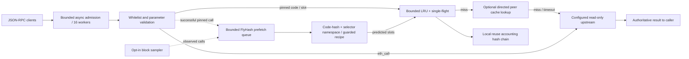

# Synaptic Edge Daemon & Mesh

PR #8 turns the read-cache and access-recipe research into an interactive,
standard-library Python service. It is a **read-only experimental edge node**,
not a BSC validator, permissionless consensus network, production-audited service,
or a complete MetaMask RPC implementation.

## Start locally

Python 3.12+; no pip install, cast, Anvil, wallet or signing key is needed:

```sh
python3 scripts/run_edge_daemon.py --port 8545
```

The default upstream is `https://bsc-dataseed.bnbchain.org`. Startup makes two
network-identity checks (chain ID and genesis). Afterwards, the default mode does
not poll or train in the background. `/` and `/rpc` accept JSON-RPC POST requests;
`/health`, `/metrics` and `/receipts` are read-only GET endpoints.

```sh
curl http://127.0.0.1:8545/ -H 'Content-Type: application/json' \
  --data '{"jsonrpc":"2.0","id":1,"method":"eth_blockNumber","params":[]}'
```

Ctrl-C or SIGTERM stops admission, drains bounded work, and writes
`.local/edge-daemon-report.json`. Set `--report` to retain separate sessions.
Reports are local operational data: receipts include requested public contract
and slot identifiers. Do not publish private workloads or URLs with credentials.
Only synthetic test reports are committed here.

### Supported profile

Exactly six upstream methods are admitted:
`eth_chainId`, `eth_blockNumber`, `eth_getBlockByNumber`, `eth_getCode`,
`eth_getStorageAt`, `eth_call`.

Signing, transactions, trace/admin methods, unknown methods, state overrides,
contract-creation calls and unsupported call fields are rejected locally. An
`eth_call` may simulate state-changing bytecode, but no simulated changes are
committed and no transaction is broadcast. This is read-only, **not zero risk**:
upstream CPU consumption, untrusted state, availability and privacy still matter.

Calls accept `to`, `from`, `data` or `input`, `value`, `gas` and standard fee
fields; explicit gas above 5 million is rejected. Omitted gas is not silently
rewritten: operators must also cap execution at the upstream. Calldata is bounded
to 4 KiB; only calls of 4–256 bytes are eligible for recipes. Batches are sequential
and limited to eight members. Notifications have no response body.

Bots may use this endpoint for these reads. Wallets often need additional methods
such as `eth_getBalance`, `eth_estimateGas` and transaction broadcast; therefore
**full MetaMask compatibility is not claimed**. Browser access is off by default.
Use repeatable `--allow-origin https://your-app.example` for exact origins only;
there is no wildcard CORS or automatic wallet permission.

## Data path



The PR #4 `ReadEdge` remains the cache/coalescing engine. `RuntimeReadEdge` adds
thread-local outcome observation and a cache-only peek; the historical module and
its evidence hashes are unchanged. Cached values are validated upstream bytes,
never neural outputs. Single-flight applies to pinned **code and storage reads**,
not arbitrary `eth_call` results.

Only EIP-1898 `blockHash` reads with `requireCanonical: false` are reusable.
`latest`, block numbers, `pending`, `safe`, `finalized` and canonical-required reads
bypass caching and mesh. Different block hashes never share values. Explicit
noncanonical access does not prove finality: the client may intentionally be
reading an orphaned block. These are upstream-trusted results, not Merkle proofs.
See [EIP-1898](https://eips.ethereum.org/EIPS/eip-1898) and
[Geth eth RPC](https://geth.ethereum.org/docs/interacting-with-geth/rpc/ns-eth).

## FlyHash runtime and proactive prewarming

`RuntimeRecipeIndex` reuses PR #7's `RecipeIndex` feature projection, WTA tags,
namespace storage and insertion. Its query/evaluator adapter preserves the
bounded recipe language, using in-process Ethereum Keccak-256 instead of spawning
`cast`. The frozen research sources are not changed. A SHA3-256 substitute would
be wrong; the new Keccak implementation is checked against 305 recorded vectors.

A runtime catalog is **opt-in**, at most 1 MiB / 256 observations, bound to chain
ID and genesis, with explicit code hash, selector, training context and SLOAD-only
recipes. Each eligible prefetch checks runtime code at the *same block hash*,
then queries the frozen FlyHash index. Unknown code/selector abstains. Proxy
implementation/state-dependent paths are not automatically learned or certified.

```sh
python3 scripts/export_daemon_catalog.py
```

This exports **80 observations from the synthetic PR #7 corpus**, for the owned
fixture network only. It is not a trained PancakeSwap/mainnet catalog. A reviewed
mainnet catalog must be supplied by the operator; the daemon does not invent one
from the known reserve slot number. The offline integration fixture separately
uses tiny synthetic bytecode reading slot 8.

Runtime catalog schema:

```json
{
  "schema": "synafly.daemon-recipes.v1",
  "chain_id": 1337,
  "genesis_hash": "<32-byte network genesis hash>",
  "entries": [{
    "code_hash": "<Ethereum Keccak-256 of deployed runtime bytecode>",
    "selector": "<4-byte selector>", "data": "<training calldata>",
    "caller": "<20-byte caller>", "value": "0x0",
    "recipe": {"accesses": [["sload", ["const", 8]]], "guards": []}
  }]
}
```

Enable prefetch with `--recipe-catalog <reviewed-file>`. `--prefetch-budget 0`
disables it without changing foreground semantics. Two workers handle at most
16 queued/running jobs, up to 60 jobs/minute by default and four slots per job.
The maximum budget is 120 jobs/minute. Repeated *pending* jobs are deduplicated;
a later request may schedule another job and consume budget even if its reads hit
cache. There is no unbounded prediction history or growing per-request index.

`--watch-blocks --watch-interval 12` additionally samples the latest header and
fetches at most one full block when the hash changes. At most 64 transactions are
considered, filtered by catalog selectors, then code-hash checked before prefetch.
A header/full-block race is rejected. This samples observed blocks, may skip
intermediate blocks, and is **not a mempool listener or guaranteed pre-arrival
predictor**. It warms state for a subsequent read of that same pinned block,
not future state and not ordinary `latest` calls.

Prefetch never substitutes for EVM execution. The original `eth_call` is returned
from the upstream; predictions fill only this edge's slot cache. There is no
claim of warming a remote node's physical NVMe or guaranteeing lower latency.
Prefetch failures are counted and do not alter the foreground return value.

## Real HTTP mesh, explicit trust

`data/mesh-topology.json` exports the exact PR #5 **58 class/side roles**, each
with six directed outgoing arcs. These are measured affinity edges plus engineered
ring/fill links, **not 58 anatomical neuropils or a full brain**. Its SHA-256 and
all adjacency lists are checked against the original pinned aggregation in tests.
MaleCNS-derived data remains CC BY 4.0; attribution/provenance is in the export,
[swarm design](swarm-topology-design.md) and [data notice](../data/NOTICE.md).

Configure role-to-origin peers explicitly. Only outgoing neighbors of the local
role are accepted, at most six. A key deterministically orders those neighbors.
A cache miss asks them sequentially through `/peer/read`; the first validated
matching envelope is used, otherwise the local origin is queried. Inbound requests
are **cache-only**: they never recurse, fan out, learn peers or fetch upstream.
No gossip flood, route repair, multi-hop owner forwarding, Sybil resistance or
permissionless enrollment is implemented in this release.

```sh
# Read the outgoing roles for role 0.
python3 -c 'from synafly_lab.edge_mesh import load_topology; print(load_topology("data/mesh-topology.json")[0])'
# Set SYNAFLY_MESH_TOKEN securely to the same random 24+ character token on both nodes.
# Start a neighbor role first; replace ROLE with one listed above.
python3 scripts/run_edge_daemon.py --port 8546 --peer-port 8646 --role ROLE
python3 scripts/run_edge_daemon.py --port 8545 --peer-port 8645 --role 0 \
  --peers ROLE=http://127.0.0.1:8646
```

Warm the neighbor through its normal RPC port, then read the same pinned slot via
the first node. `scripts/verify_edge_daemon.py` automates this with independent
processes and also verifies fallback after the neighbor exits.

**Peers are operator-trusted.** A shared bearer token admits the configured group;
TLS authenticates remote endpoints, but the protocol has no independent Ethereum
storage proof and cannot detect a peer lying with a well-formed 32-byte value.
The envelope binds network, full request key and role; that prevents accidental
mixups, not malicious false state. Use isolated/tightly controlled peers only.
Remote URLs must be bare HTTPS origins (no credentials, paths or redirects).
Local fixture peers may use HTTP. No public mesh is deployed by this PR.

## Accounting receipts and registry compatibility

Successful local cache/coalesced reuse or a trusted peer hit of a pinned storage
read appends a bounded receipt containing timestamp, block hash, contract, slot,
source, `upstream_saved: 1`, sequence, parent and SHA-256 receipt hash. It states
one avoided *foreground RPC relative to forwarding that request*, not one proven
NVMe operation or one unit of money. Prefetch/cache hits are subject to this same
accounting; all speculative origin costs remain in the upstream metrics.

The envelope includes a `ContinuityRegistry.Commitment`-shaped object: `lineage`,
`graph`, `model`, `checkpoint`, `parent`, `sequence`, `tick`. A fresh lineage begins
at sequence/tick zero with a zero parent; subsequent ticks strictly increase.
For the existing Python `anchor.message_calldata` helper, strip the `0x` prefix
from the five bytes32 fields; the exported JSON uses conventional RPC hex strings.
An offline test checks this ABI encoding. A session reset creates a new lineage. Retention is 1,024 receipts by default,
so long-running exports can be suffixes whose older parents are no longer retained.

This is **ABI field/chain-sequence compatibility, not an on-chain proof**. No
witness signatures, signed quorum certificate, transaction, gas payment or reward
is produced. Independent witnesses would need to review evidence and follow the
registry's EIP-191 signing rules. The existing contract does not validate RPC
savings; anyone can invent an unsigned accounting chain. It remains unchanged.

## Resource, deployment and security boundaries

| Resource | Default / bound |
|---|---|
| Async admitted HTTP work | 1,024; configurable 1–5,000 via `--capacity` |
| Connections held by parser | admission capacity + 128; excess receives 503 |
| Foreground worker threads | 16 |
| In-flight cache origin keys | 16 |
| Cache entries / value bytes | 1,024 / 4 MiB; configurable up to engine bounds |
| Cache TTL | 60 seconds |
| HTTP headers / body | 8 KiB parser / 16 KiB body |
| Upstream response | 256 KiB |
| Prefetch | two workers, 16 jobs, four slots/job |
| Mesh | at most six neighbors, 0.3 s each after connect |
| Receipt ring | 1,024 entries |

JSON duplicates, oversized bodies, ambiguous framing, Host/Origin mismatches and
write methods are rejected. HTTP admission overload is reported separately, never
counted as offload. Upstream timeouts and failed prefetch attempts are counted.
The inherited socket client does not follow redirects or use configured network
proxies. Platform DNS lookup is outside Python's socket timeout guarantee.

LRU value bytes exclude Python object overhead, queues, response buffers and
receipts. Bounded containers and measured RSS are not a mathematical proof of no
memory leaks or a multi-day soak test. Keep load limits and monitor actual RSS.

Local RPC is loopback-only. VPS use should prefer an SSH tunnel. Remote bind
`--host 0.0.0.0` requires `SYNAFLY_RPC_TOKEN`; exact external Host values require
`--allowed-host host:port`. Put remote RPC and peers behind an operator-managed
TLS/firewall gateway; do not expose an unauthenticated public relay.

### Container

```sh
docker build -t synafly/edge-node .
# Set SYNAFLY_RPC_TOKEN securely in your shell before running.
docker run --rm --init -p 127.0.0.1:8545:8545 \
  -e SYNAFLY_RPC_TOKEN synafly/edge-node
```

The image uses the official Python 3.12 slim runtime, a non-root user, and no pip
packages. The allowlisted build context excludes credentials, Git history,
research output and sibling projects. No image is pushed to a registry. This
checkout's environment has no Docker engine; build/runtime portability remains
unverified here. Production operators should pin an approved image digest, mount
a writable private report directory and apply CPU/memory limits. Bare
`docker run -p 8545:8545 ...` without a token intentionally fails closed.

## Reproduce

```sh
python3 -m unittest discover -s tests -v
forge test --offline -v
python3 scripts/verify_edge_daemon.py --out .local/daemon-verification.json
python3 scripts/stress_edge_daemon.py --clients 1000 5000 --out .local/daemon-stress.json
# OPTIONAL: explicitly opts into a small real BSC read-only check, never CI.
python3 scripts/verify_edge_daemon.py --live --out .local/daemon-mainnet.json
```

The stress script only creates an owned loopback origin; it has no public upstream
flag. Its default 65-second inter-case cooldown avoids conflating repeated short-
connection pressure with a single cold burst; `--cooldown 0` exposes that stress
condition explicitly. Cold-burst results do not establish sustained throughput. Random/distinct keys, `latest`, and a capacity-64 overload case accompany the
hot-key result. See [recorded results](edge-daemon-results.md). All CI daemon tests
and the multi-process demonstration use localhost, never public BSC or Anvil.
