# Receipt witness quorum and registry commitment pipeline

PR #9 connects the PR #8 daemon's receipt stream to the existing
`ContinuityRegistry.sol`. It implements deterministic receipt batching, Merkle
inclusion proofs, real EIP-191 signature recovery, ordered quorum aggregation,
ABI transaction construction, and exact receipt/event verification.

**Implemented endpoint:** actual deployment and commit transactions on an owned
local Anvil chain. **Not claimed:** a public BSC deployment, independent operators,
trustless offload verification, financial rewards, or measured infrastructure savings.

## Reproduce the complete local loop

Requirements: Python 3.12+, installed Foundry (`forge`, `anvil`) and the repository's
cached Solidity 0.8.30 compiler. There are no pip/runtime dependencies or private-key
arguments. `forge build --offline` must succeed first; the script does not install
a compiler or download packages.

```sh
python3 scripts/verify_quorum_pipeline.py --local-anvil \
  --out .local/quorum-pipeline.json
# Equivalent relayer entrypoint:
python3 scripts/relay_offload_commitments.py local-anvil \
  --out .local/quorum-pipeline.json
```

The script:

1. Spawns its own loopback Anvil, suppressing its mnemonic/key output.
2. Uses development accounts unlocked by that owned process, deploying the unchanged
   registry with a sorted three-address committee and threshold two.
3. Checks deployed runtime bytes against the compiled artifact, including the
   immutable threshold substitutions.
4. Starts three separate PR #8 daemon processes (roles 0, 1, 2) with authenticated
   outgoing-neighbor connections. A synthetic slot-reader contract is used; it is
   not PancakeSwap. Its initial code/storage is prepared using local fixture methods.
5. Exercises peer reuse and concurrent reads, then a successful `eth_call` triggers
   code-matched FlyHash prefetch at a new pinned block. The following slot read must
   cause no extra origin request.
6. Reads the actual daemon receipt snapshots, validates role 0's complete stream,
   and splits it into two consecutive batches. Other roles' receipts are retained
   in the report but are not mixed into that lineage.
7. Runs registry preflight. Three distinct development accounts approve deterministic
   bundle rebuilds and sign; two signatures are recovered, validated and sorted.
8. A fourth development account, not a committee member, relays each `commit(...)`.
   Successful receipts, exact event payloads, gas, transaction calldata, block
   identity, confirmation depth and registry heads are verified.
9. Exercises ten exact EVM rejection cases and broadcasts one actual replay attempt,
   which must have status zero, no checkpoint event, and an unchanged registry head.
10. Stops only the processes it created and writes the report.

All writes are confined to a newly spawned owned node. The write-capable fixture
has no URL argument. A local chain ID of 97 **does not make these public BSC Testnet
transactions**. No real wallet, private key file, secret recovery phrase or funds
are requested/read. Addresses/signatures in the published report are development
fixtures, not user credentials.

## One-command three-process mesh

```sh
# Interactive localhost fixture; defaults to RPC ports 8545, 8546, 8547.
python3 scripts/run_mesh_cluster.py
# Exercise the flow, export evidence and exit; use OS-selected free ports.
python3 scripts/run_mesh_cluster.py --demo --ports 0 0 0 \
  --out .local/mesh-cluster.json
```

Default operation is offline and uses an owned Python wire origin. The EVM verifier
supplies its own Anvil origin through the harness API. The three roles use the
exact PR #5 adjacency restricted to these deployed roles: `0→1`, `1→0`, `1→2`,
`2→1`. Peer tokens are random, local, passed through child environments and not
exported. Occupied requested ports fail instead of stopping another application.

This proves actual inter-process HTTP communication and receipt generation on one
host. It does not prove geographic or administrative decentralization. PR #8's
trusted-peer/state-proof limitations remain unchanged.

## Pipeline and trust boundaries

```mermaid
flowchart LR
  D[Three edge daemon processes] --> R[Captured PR8 receipt stream]
  R --> V[Hash / lineage / sequence validation]
  V --> M[Count-bound ordered Merkle root]
  M --> B[Checkpoint bundle and signing domain]
  B --> W[Witness approval and EIP-191 signatures]
  W --> Q[Recover / membership / unique / sorted / threshold]
  Q --> T[ABI commit transaction]
  T --> E[ContinuityRegistry on local Anvil]
  E --> P[Receipt / event / gas / head verification]
```



The witness policy is explicitly **receipt integrity and continuity**. Witnesses
check canonical content, hashes, graph/model stability, sequencing and the target
registry. They do not independently observe every user's request or prove the
counterfactual that an upstream operation would otherwise have occurred. Colluding
witnesses can approve fabricated but internally consistent receipts. A signature
is an attestation, not an economic measurement or proof of useful work.

## Two distinct chains

### Receipt chain

PR #8 receipt bytes are unchanged. Each row contains a timestamp, block hash,
contract, slot, reuse source, one operator-accounted avoided foreground request,
lineage, sequence, parent, receipt hash and embedded commitment-shaped metadata.

The validator requires exact fields, bounded integers, canonical lowercase hex,
valid SHA-256 receipt hashes, consecutive sequence numbers and matching parents.
It also validates embedded commitment fields: checkpoint equals receipt hash,
lineage/parent/sequence match the row, and tick equals receipt sequence. Graph and
model must remain fixed within the stream. A batch holds 1–256 receipts, with
encoded receipt bytes limited to 512 KiB.

A genesis batch must begin at receipt sequence zero. A later batch begins exactly
after its supplied predecessor's final receipt/hash. Retained suffixes cannot
silently become a new genesis. Missing, replayed, overlapping, reordered and mixed
streams are rejected. Predecessor contents, root, cursor and signing domain are
validated; before submission, the predecessor must also equal the registry's head.
Operators must retain prior bundles. The daemon's bounded receipt ring alone is
not a perpetual archive.

### Merkle checkpoint chain

Canonical JSON uses the repository's sorted-key ASCII `encode` function. For a
receipt `r`, leaf `L = SHA256(0x00 || canonical(r))` commits **the whole row**, including
embedded graph/model fields. Internal nodes are
`SHA256(0x01 || left || right)`; an odd last child duplicates itself.

The exported root is `SHA256(0x02 || uint64_be(count) || tree_root)`. Count binding
avoids ambiguity from the odd-child rule. Proofs carry index, count and ordered
siblings; proof depth/position/count and odd duplication are checked. The registry
treats this root as an opaque bytes32; it does not verify a Merkle proof itself.

The aggregated `Commitment` is:

| Field | Definition |
|---|---|
| lineage | SHA-256 domain binding of chain ID, registry address and receipt lineage |
| graph | Receipt stream's PR #8 graph identifier |
| model | Versioned policy hash binding receipt model, validation scope, registry runtime hash, committee and threshold |
| checkpoint | Count-bound Merkle root for this batch |
| parent | Previous **Merkle checkpoint root**, not the last individual receipt hash |
| sequence | Checkpoint sequence starting at zero |
| tick | Zero for genesis as required by the contract; then final receipt sequence + 1 |

This is a new checkpoint domain, not the LIF model's simulation ticks. After genesis,
model/graph remain fixed and ticks increase. Changing committee/policy/registry
requires an explicit new compatible deployment/lineage, not silent mutation.

## Signing and quorum

The exact existing contract message is:

```text
message = keccak256(abi.encode(
  keccak256("SynaFly.ContinuityRegistry.v1"), chainId, registryAddress,
  lineage, graph, model, checkpoint, parent, sequence, tick
))
digest = keccak256("\x19Ethereum Signed Message:\n32" || message)
```

This is **EIP-191 personal-sign**, not EIP-712. Sign the 32 message bytes, not the
ASCII characters of the hex string, and do not apply the prefix twice.
[EIP-191 specification](https://eips.ethereum.org/EIPS/eip-191).

`quorum_crypto.py` recovers public signer addresses using secp256k1. It contains no
private-key signing function. It validates 65-byte signatures, `v=27/28`, scalar
bounds and low-s, matching the registry. The implementation is standard-library
research code, **not an independently audited cryptographic library**. Curve
parameters follow [Standards for Efficient Cryptography 2 (SEC 2), §2.4.1](https://www.secg.org/sec2-v2.pdf).

Signature envelopes contain signer, signature and deterministic bundle hash. The
collector rebuilds the bundle, recovers every signer, rejects unknown/mismatched
or duplicate members, checks the threshold and sorts signatures by numeric address.
It never trusts a claimed signer name. Reordered input is accepted and normalized;
duplicate votes are not deduplicated into apparent quorum.

Preflight checks chain ID, pinned runtime code hash, threshold, each `isWitness`
value, the sorted `witnesses(i)` getters and exact array termination. Solidity
0.8.30's generated getter returns an empty revert at the first out-of-bounds index;
this is checked as such, not mislabeled as `Panic(0x32)`. Registry `messageHash` and
`signingDigest` must match the local computation. The expected head is read at the
same canonical-required block hash. A concurrent head change can still cause the
later transaction to revert; never bypass the contract's guard or automatically
resubmit an uncertain transaction.

## Public BSC Testnet handoff (no automatic broadcast)

No public contract/account/budget was selected for this release. The public path
therefore supports chain-97 preparation, external signing and verification only:

```sh
python3 scripts/relay_offload_commitments.py prepare \
  --receipts reviewed-receipts.json --registry <registry-address> \
  --runtime-code-hash <reviewed-runtime-keccak> \
  --committee <lowercase-witness-1> <lowercase-witness-2> <lowercase-witness-3> \
  --threshold 2 --out checkpoint.json
python3 scripts/relay_offload_commitments.py preflight \
  --bundle checkpoint.json --rpc <testnet-https-origin> --out preflight.json
# Witnesses review the bundle, then use their own wallets to personal-sign message_hash.
python3 scripts/relay_offload_commitments.py collect \
  --bundle checkpoint.json --signatures witness-envelopes.json --out certificate.json
# A user-managed relayer reviews/fills nonce, gas and fees and broadcasts transaction.
python3 scripts/relay_offload_commitments.py verify \
  --bundle checkpoint.json --signatures witness-envelopes.json \
  --rpc <testnet-https-origin> --tx-hash <broadcast-transaction-hash> \
  --confirmations 3 --out confirmed.json
```

Successor commands require `--previous` with the retained predecessor bundle.
The certificate contains unsigned `chainId`, `to`, `value=0` and ABI `data`; it does
not choose a user's account, spend funds or store keys. Public deployment, signing
and sending remain external/user-managed and were **not performed or tested on
BSC Testnet here**. The core public RPC adapter rejects signing/sending methods.
RPC URLs are bare HTTPS origins, without embedded credentials or redirects.

Verification checks the transaction's destination/input/value/chain and block,
status, gas, exact single event topic/indexed lineage/data, canonical block view,
confirmation count, checkpoint-block head, and a second block read to detect an
observed reorg. This trusts the configured provider, not a PoSA light-client proof.
A finite confirmation count is not an absolute finality guarantee.

## Evidence, CI and compatibility

Default verification is offline:

```sh
python3 scripts/verify_quorum_pipeline.py
python3 -m unittest discover -s tests -v
forge test --offline -v
```

CI uses recorded replies from the actual Anvil run, strict ordered wire replay,
real Merkle computation and real signature recovery. It does **not** pretend that
a wire mock executes EVM bytecode. The separate `--local-anvil` mode is the actual
broadcast reproduction. Reports are nondeterministic across runs because receipt
lineages/timestamps differ; roots and signatures are deterministic for fixed input.

Only new files are added in this PR. The contract, existing runtime modules,
workflows, README and earlier reports are evidence-locked and stay unchanged.
The existing CI discovers the new test module. See the [results and limitations](quorum-pipeline-results.md).
